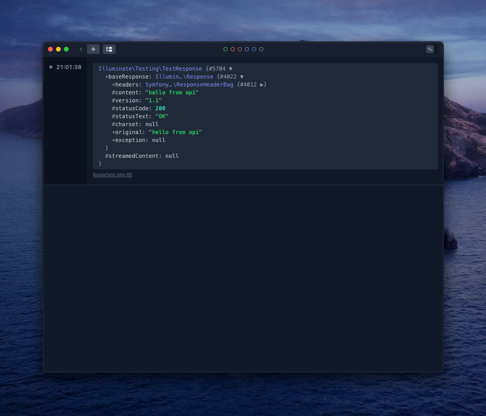
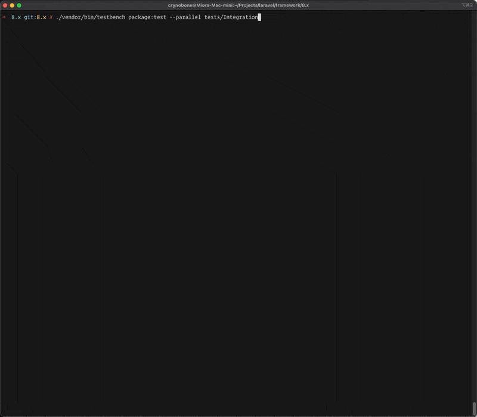

# Integrations

Testbench hopes to provide a complete solution for package developments, in latest version we now support direct integrations with following 3rd party packages:

## Spatie Ray

Starting from Testbench 6.10 you may now use Ray debugging tool directly when running tests. 

```php
    /** @test */
    public function it_can_resolve_domain_route()
    {
        $response = $this->get('http://api.localhost/hello');

        ray($response);
    }
```



### Configuration

You can configure Ray using `phpunit.xml`:

```xml
<phpunit>

    // ...

    <php>
        <env name="RAY_ENABLED" value="(true)"/>
        <env name="SEND_CACHE_TO_RAY" value="(false)"/>
        <env name="SEND_DUMPS_TO_RAY" value="(true)"/>
        <env name="SEND_JOBS_TO_RAY" value="(false)"/>
        <env name="SEND_LOG_CALLS_TO_RAY" value="(true)"/>
        <env name="SEND_QUERIES_TO_RAY" value="(false)"/>
        <env name="SEND_REQUESTS_TO_RAY" value="(false)"/>
        <env name="SEND_VIEWS_TO_RAY" value="(false)"/>
        <env name="SEND_EXCEPTIONS_TO_RAY" value="(true)"/>
    </php>

</phpunit>
```

## Collision

You can also utilise Collision with Testbench to use Laravel flavored artisan test command, including parallel testing. First of all include `nunomaduro/collision` to your package:

```
composer require --dev "nunomaduro/collision"
```

After installation complete and `package:discover` executed you should be able to use `package:test` command directly from Testbench CLI Commander:

```
php vendor/bin/testbench package:test
```


:::tip Support for Parallel Testing 

With `package:test` you are able to use `--parallel` options to use Parallel Testing. However do review [Laravel documentation](https://laravel.com/docs/8.x/testing#running-tests-in-parallel) regarding the subject.
:::



> Recommended minimum version to use parallel testing is `6.15.0`
